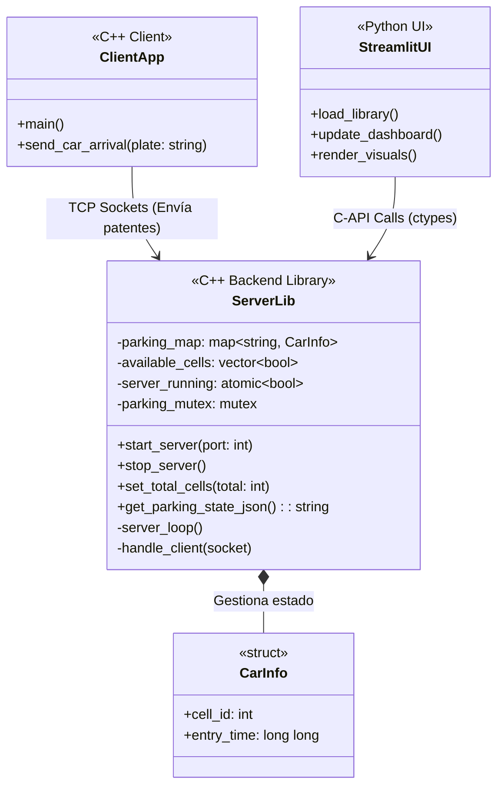

# 🚗 Parking Lot System


## 📌 Características
- **Backend C++**: Gestiona la lógica del estacionamiento y conexiones simultáneas mediante multithreading.
- **Cliente C++**: Simulador de llegadas de vehículos (envío de patentes vía TCP Sockets).
- **Interfaz Streamlit**: UI en Python en tiempo real para visualizar ocupación, tiempos y facturación.
- **Dockerizado**: Construcción y ejecución simplificada a través de Docker y CMake.

## 🏗️ Arquitectura y Diagrama UML

El diseño se compone de tres módulos principales (Cliente, Servidor, UI). A continuación se presenta el Diagrama de Clases UML que ilustra las relaciones y estructuras de datos para cumplir con la rúbrica del proyecto.

> **Nota:** El archivo original del diagrama se encuentra en [`docs/diagrama_uml.md`](./docs/diagrama_uml.md)



## 🚀 Cómo ejecutar

### Usando Docker
El proyecto puede ser ejecutado y orquestado en contenedores mediante Docker Compose:
```bash
docker-compose up --build
```

### Compilación Manual
1. Construir el backend y el cliente usando CMake en el directorio `src/`.
2. Iniciar el servidor embebido al abrir la UI o ejecutando los binarios correspondientes.
3. Ejecutar la UI de Streamlit:
```bash
streamlit run src/ui/app.py
```
