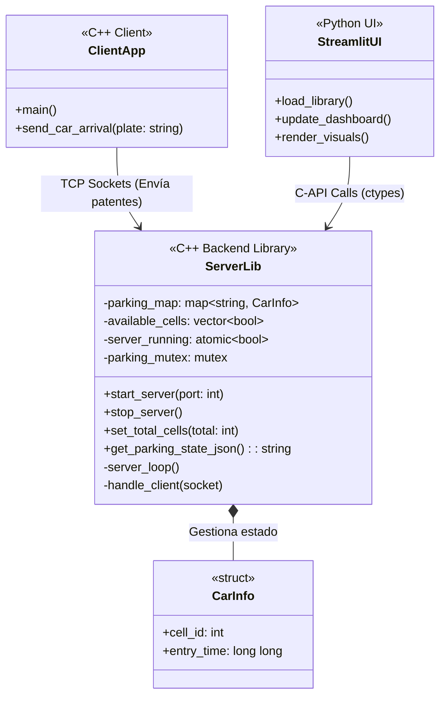

# Diagrama UML de Arquitectura

El siguiente diagrama de clases muestra la arquitectura del sistema de estacionamiento, detallando la interacción entre el cliente C++, la librería del servidor C++ y la interfaz de Python (Streamlit).

